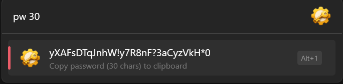

# Simple Password Generator (Flow Launcher Plugin)

A lightweight Flow Launcher plugin that generates secure random passwords and copies them to the clipboard.

## Features
- Cryptographically secure randomness
- Configurable default password length
- Optional digits
- Optional symbols (toggle each symbol individually)
- Letter mode:
  - lower-case only
  - UPPER-case only
  - lower + UPPER
- Copies the generated password to clipboard with one action
- Optional length override directly in the query

## Usage
1. Open Flow Launcher.
2. Type the action keyword:

   `pw`

3. Press Enter on the result to copy the generated password.

### Example: without arguments
`pw` generates a password using the default length from plugin settings.

### Example: with length argument
You can provide a number after the keyword to override the length:

- `pw 30` → generates a 30-character password

If no number is provided, the plugin uses the **Default length** from the plugin settings.

## Settings
Open: `Settings → Plugins → Simple Password Generator`

You can configure:
- Default length
- Include digits (0–9)
- Letter mode (lower / upper / both)
- Symbols (enable/disable each symbol)